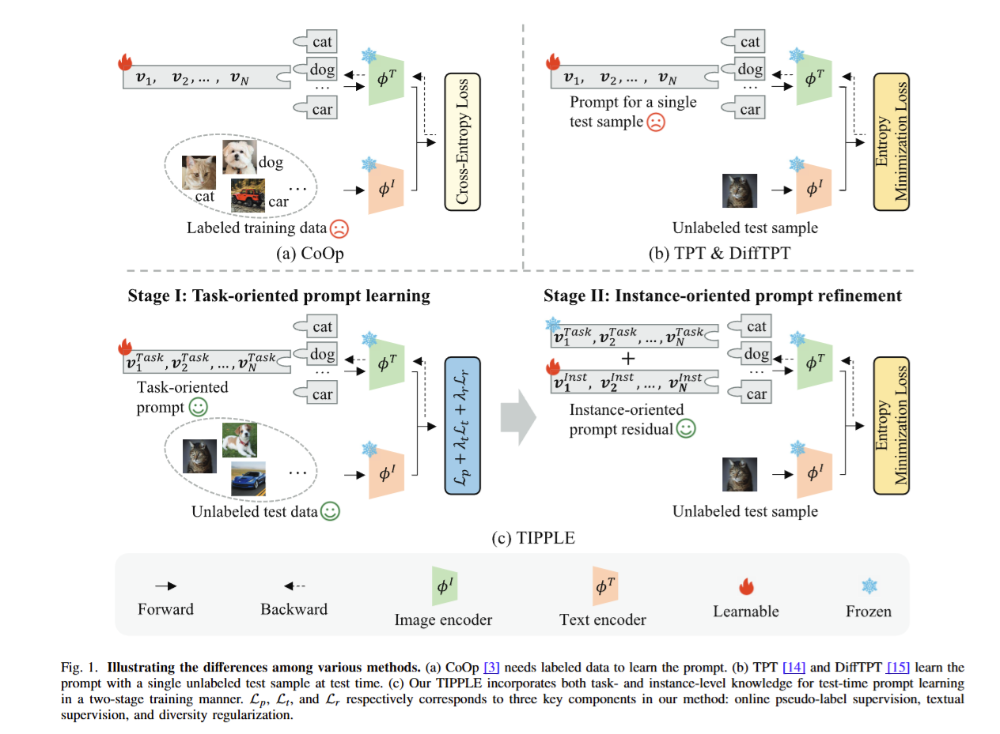
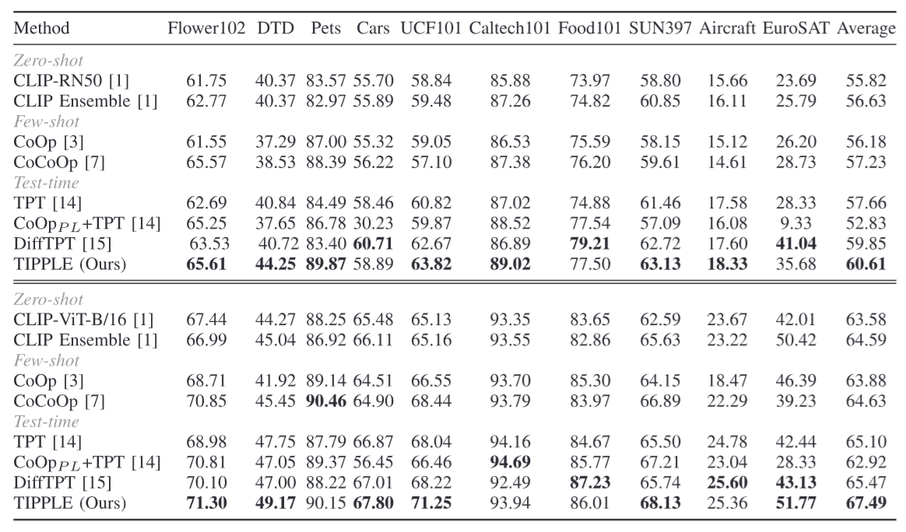
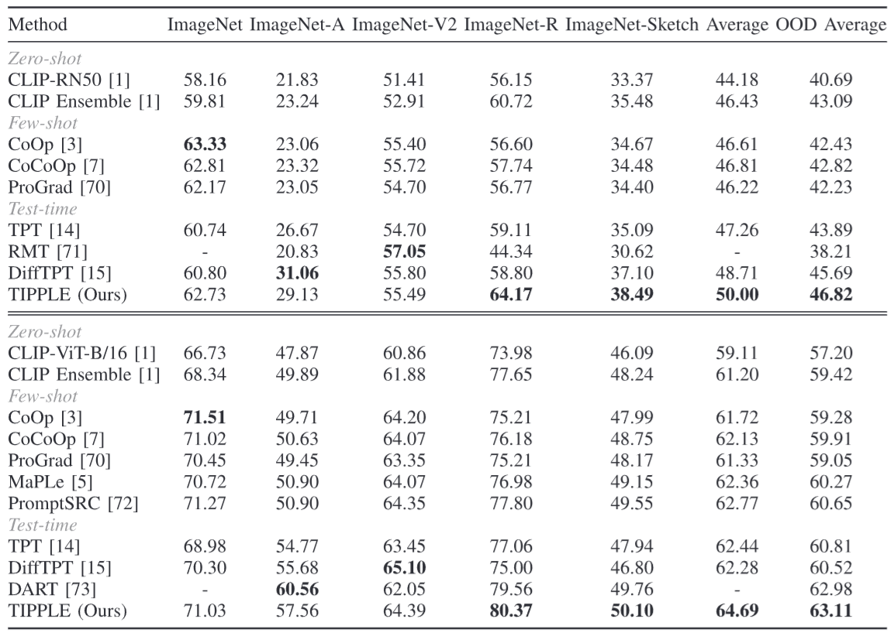

# TIPPLE

This repository provides the official PyTorch implementation of our TIP 2025 paper:    

> Task-to-Instance Prompt Learning for Vision-Language Models at Test Time
> Authors: Zhihe Lu*, Jiawang Bai*, Xin Li, Zeyu Xiao, Xinchao Wang

For more details, please check out our [<ins>**paper**</ins>](https://ieeexplore.ieee.org/stamp/stamp.jsp?arnumber=10925517). 

## Overview
We propose a novel test-time prompt learning method of VLMs, called Task-to-Instance PromPt LEarning (TIPPLE), which adopts a two-stage training strategy to leverage both task- and instance-level knowledge. Specifically, we reformulate the effective online pseudo-labeling paradigm along with two tailored components: an auxiliary text classification task and a diversity regularization term, to serve the task-oriented prompt learning. After that, the learned task-level prompt is further combined with a tunable residual for each test sample to integrate with instance-level knowledge.

<p align="center">
    
</p>


## Prerequisites

### Installation
For installation and other package requirements, please follow the instructions detailed in [INSTALL.md](../docs/INSTALL.md).

### Data Preparation 
Please follow the instructions at [DATASETS.md](../docs/DATASETS.md) to prepare all datasets.


## Run TIPPLE

We provide the bash script under `./scripts`. You can modify the paths and other args in the scripts. Please also change the "model_path" for pretrained CLIP models in the files `./clip/custom_clip.py` and `./clip/custom_clip_batch_single.py`.

An example to run TIPPLE:
```
sh scripts/test.sh
```


### Main Results

#### 1. Comparison on the datasets from various domains

<p align="center">
    
</p>

#### 2. Comparison on the OOD datasets

<p align="center">
    
</p>

## Citation
If you find our code useful or our work relevant, please consider citing: 
```
@article{lu2025task,
  title={Task-to-Instance Prompt Learning for Vision-Language Models at Test Time},
  author={Lu, Zhihe and Bai, Jiawang and Li, Xin and Xiao, Zeyu and Wang, Xinchao},
  journal={IEEE Transactions on Image Processing},
  year={2025},
  publisher={IEEE}
}
```

## Acknowledgements
We thank the authors of [CoOp/CoCoOp/TPT](https://github.com/KaiyangZhou/CoOp, https://github.com/azshue/TPT/tree/main) for their open-source implementation and instructions on data preparation. 
